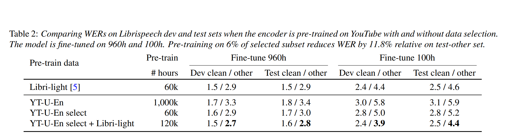
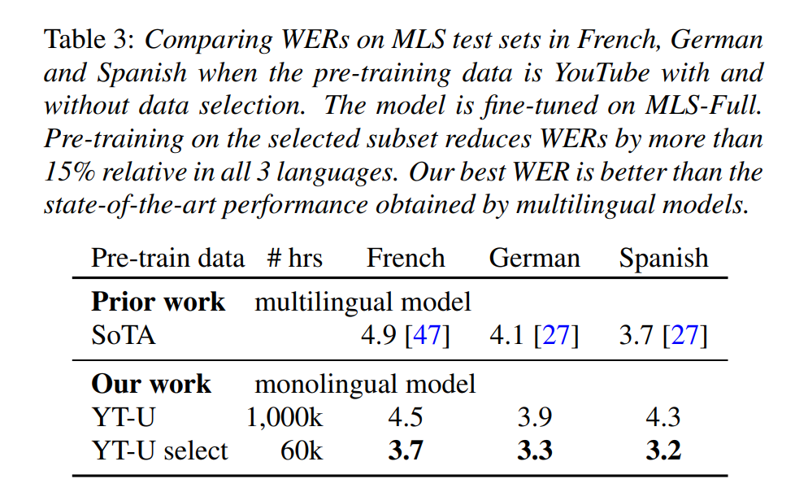

## Unsupervised Data Selection via Discrete Speech Representation for ASR
[arxiv](https://arxiv.org/pdf/2204.01981.pdf)

**Goal**: 
Improve model performance on specific target domain $T$.
For example:
- ASR in very noisy env.
  
- Speech recognition and ASR in small meeting room.

**Condition**:
- Maybe don't have many data on target domain $T$, but have another large "unlabeled" dataset $G$. However, this dataset may have too many data that is un-related to target domain.
  
- Have a general model $M$, and need to fine-tune this model to fit target domain $T$.
  
**Problem**:

- How to select representative data in $G$ to improve model performance on $T$ domain ?

**BreakingThrough**:
- Use #language-model to sample a subset $g$ from $G$, that $P(g) \sim P(T)$. 
  
- Train two language-model $P_G$ and $P_T$ on dataset $G$ and $T$, respectively. For sample $g \in G$, it is selected if $\frac{log P_T( g )  - log(P_G(g))}{len(g)}$ is high.

**Common Misunderstanding**:
- Select $g \in G$ that $P_T(g)$ is high. 
 
    $P(g \in G)$ is not 0 or 1, and it is a probability. That means for even for specific $g \in G$, some of $g$ are in $T$ and some are not.

**Results**:
ASR performance is improved with much less data on different datasets with both pretraining and supervised scenario.

